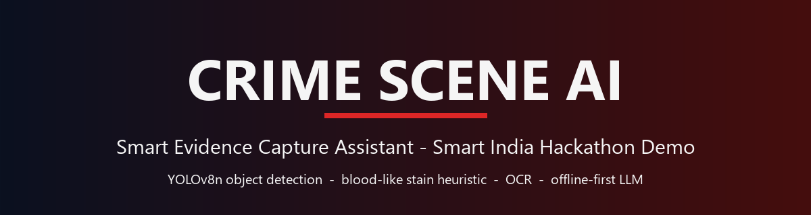
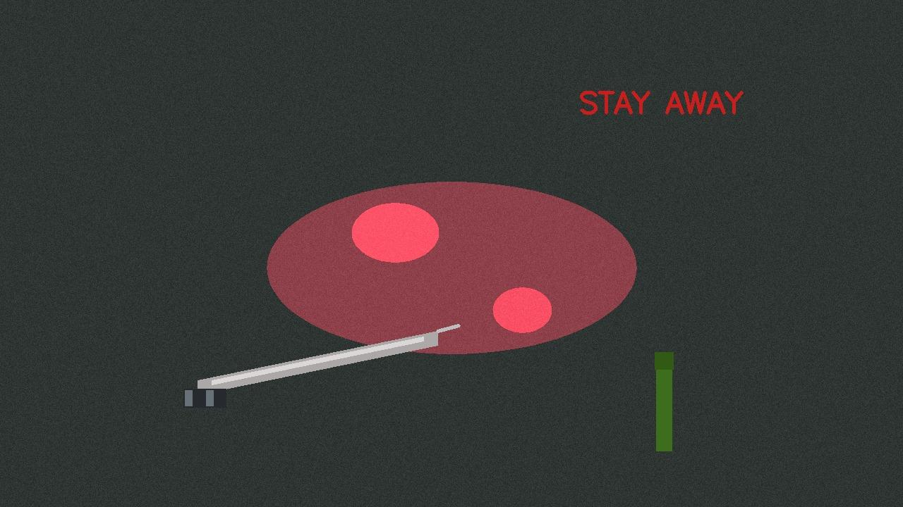

<div align="center">



# 🕵️ Crime Scene AI

**Smart Evidence Capture Assistant · Smart India Hackathon (SIH) Demo**

Turn a crime-scene photo into a **reviewable draft report** — explainable vision
analysis, bilingual narrative (🇬🇧 EN / 🇮🇳 HI), human-in-the-loop confirmation,
chain-of-custody logging, and pattern matching against past cases. **Fully
offline-capable.**

<br/>

[](https://www.python.org/downloads/)
[](https://fastapi.tiangolo.com/)
[](https://react.dev/)
[](https://www.typescriptlang.org/)
[](https://docs.ultralytics.com/)
[](https://www.sqlite.org/)
[](LICENSE)

<br/>

[](https://github.com/Aritra709/crime-scene-ai/stargazers)
[](https://github.com/Aritra709/crime-scene-ai/forks)
[](https://github.com/Aritra709/crime-scene-ai/commits/main)
[](https://github.com/Aritra709/crime-scene-ai)

**offline-first** · **explainable** · **human-in-the-loop** · **multilingual**

</div>

---

## ✨ What it does

```
📸 Upload → 🔍 Analyze → ✍️ Review draft → ✅ Confirm → 🗂️ Log & match
```

1. **📸 Capture** — Officer uploads a crime-scene photo; EXIF GPS + timestamp are read automatically.
2. **🔍 Analyze** — The vision layer extracts **objects**, **blood-like stains**, and **text** — every detection carries a *confidence score, source, and basis* (no black-box verdicts).
3. **🤖 Reason** — The LLM drafts a preliminary observation report in **English + Hindi**, flags anomalies, and suggests next steps.
4. **✍️ Review** — The officer **confirms, edits, or rejects** every detection before anything is logged.
5. **🗂️ Log & match** — The confirmed report enters the case file with **chain-of-custody metadata** and is matched against **past confirmed cases**.

> ⚖️ **Human-in-the-loop by design** — AI output is always a *draft*. Nothing
> becomes evidence until the officer confirms it.

## 🧠 Key features

| | Feature | Why it matters |
|---|---|---|
| 🎯 | **Explainable detections** | Confidence + source (`yolo` / `hsv-heuristic` / `ocr`) + basis on every finding |
| 🩸 | **Blood-like stain heuristic** | HSV red-hue + morphology + area/saturation — always framed as a *candidate*, never a verdict |
| 🔍 | **YOLOv8n object detection** | COCO model mapped to crime-relevant categories (knife → bladed weapon, vehicles, bags…) |
| 📝 | **OCR text extraction** | EasyOCR / Tesseract (optional, degrades gracefully) |
| 🕵️ | **Tamper check (ELA)** | JPEG re-encode difference + EXIF sanity — reported as `"inconclusive"` |
| 🌐 | **Bilingual narrative** | English + Hindi draft reports; canonical English stored for honest matching |
| 🔒 | **Chain of custody** | Officer ID, GPS, timestamps, full audit trail in SQLite |
| 🔗 | **Pattern matching** | Category-overlap scoring against past confirmed cases |
| 📴 | **Offline-first** | Heuristic vision + mock LLM run with zero network — real models are plug-in upgrades |

## 📸 Demo in action

<div align="center">

**Upload a crime-scene photo…**



…and get an explainable, bilingual draft report you can confirm or edit.

</div>

## ⚖️ Design principles

From the SIH brief — five pillars:

1. **Working end-to-end demo** — runs fully offline with a mock LLM + heuristic vision; YOLO / OCR / LLM-API are plug-in upgrades.
2. **Explainability** — every detection carries a confidence score, source and basis. No black-box verdicts.
3. **Offline / low-bandwidth** — vision heuristics + mock reasoning run on a laptop / edge box with zero network; EXIF-based capture, no cloud round-trip for the core demo.
4. **Human-in-the-loop** — nothing is logged until the officer confirms; the AI output is a *draft*.
5. **Multilingual** — narrative generated in canonical English, rendered / translated at the client (IndicTrans / LLM translation at render time); the DB stores the canonical form so pattern matching stays honest.

## 🏗️ Architecture

```
Photo + EXIF (GPS, timestamp)
   │  POST /api/upload
   ▼
Vision layer (explainable, optional YOLO)
   ├─ Object detection   YOLOv8n (ultralytics, COCO) — mapped to crime-relevant
   │                      categories (knife→bladed weapon, vehicles, bags…)
   ├─ Blood-like stain   HSV red-hue heuristic + morphology + area/saturation basis
   ├─ OCR                EasyOCR/Tesseract (optional; skipped when absent)
   └─ Tamper check       JPEG re-encode ELA diff + EXIF sanity (never a verdict)
   ▼
Reasoning layer (LLM via API, or offline mock)
   Structured detections → strict-JSON prompt → narrative + anomaly flags + next steps
   ▼
Officer review (React UI)
   Confirm / edit / reject every detection, stain, OCR line, narrative, next step
   ▼
Case log (SQLite) — officer ID, GPS, timestamps, audit trail
   ▼
Pattern matching — category-overlap scoring vs past confirmed cases
```

## 📦 Tech stack

| Layer | Technology |
|---|---|
| ⚙️ Backend | Python 3.10+ · FastAPI · uvicorn · OpenCV · Pillow · NumPy |
| 👁️ Vision (opt-in) | YOLOv8n (`ultralytics`) · EasyOCR / Tesseract |
| 🧠 Reasoning | OpenAI-compatible LLM API · offline mock fallback |
| 🎨 Frontend | React 18 · TypeScript · Vite (mobile-first) |
| 🗄️ Storage | SQLite case log with audit trail |
| 🐳 Deploy | Docker · Hugging Face Spaces · Streamlit Community Cloud · Gradio |

## 📁 Repo layout

<details>
<summary><b>Click to expand</b> the full directory structure</summary>

```
crime-scene-ai/
├── backend/               FastAPI service (Python 3.10+)
│   ├── app/main.py        API entrypoint, static image serving
│   ├── app/pipeline.py    orchestrates vision → reasoning
│   ├── app/vision/        detector.py (YOLO), stains.py, ocr.py, tamper.py
│   ├── app/reasoning.py   LLM call (OpenAI-compatible) + offline mock
│   ├── app/db.py          SQLite case log + pattern matching
│   └── data/              images + cases.db (gitignored)
├── frontend/              React + Vite + TS (mobile-first)
│   └── src/components/    UploadView, ImageAnnotator (canvas), ReportEditor, CaseList
├── scripts/               sample-image generator + end-to-end API test
├── docs/                  banner + assets
├── gradio_app.py          Gradio port (Hugging Face Space)
└── streamlit_app.py       Streamlit port (Community Cloud, torch-free YOLO via ONNX)
```

</details>

## 🚀 Quick start

<details open>
<summary><b>1️⃣ Backend</b> — start the API on <code>:8000</code></summary>

```powershell
cd backend
python -m venv .venv
.\.venv\Scripts\Activate.ps1
pip install -r requirements.txt        # core (offline demo ready)
pip install -r requirements-ai.txt     # OPTIONAL: YOLO + OCR (needs internet once)
$env:OPENAI_API_KEY = "sk-..."        # OPTIONAL: real LLM reasoning
uvicorn app.main:app --port 8000
```

</details>

<details open>
<summary><b>2️⃣ Frontend</b> — start the dev UI on <code>:5173</code> (separate terminal)</summary>

```powershell
cd frontend
npm install
npm run dev                            # http://localhost:5173  (proxies /api → :8000)
```

</details>

<details open>
<summary><b>3️⃣ End-to-end test</b> — no UI needed</summary>

```powershell
python scripts\make_sample_image.py    # synthetic "crime scene" photo (stain heuristic demo)
python scripts\demo_test.py            # upload → analysis → confirm → matches
python scripts\demo_test.py http://localhost:8000 scripts\sample_real_photo.jpg
                                       # same loop with a REAL photo → YOLO vehicle/person detection
```

</details>

## 🔌 Enabling the real models (optional)

| Component | Install | Effect |
|---|---|---|
| 🎯 YOLOv8n object detection | `pip install -r requirements-ai.txt` (first run downloads `yolov8n.pt` weights) | `source: "yolo"` detections for knife/car/bag/… |
| 📝 OCR | `pip install -r requirements-ai.txt` + Tesseract binary: `winget install UB-Mannheim.TesseractOCR` (override path via `$env:TESSERACT_CMD`) | `ocr` entries in analysis |
| 🧠 LLM reasoning | `$env:OPENAI_API_KEY` (+ optional `OPENAI_BASE_URL`, `OPENAI_MODEL`) | `llm.source: "openai"` instead of `"mock"` |

Everything **degrades gracefully**: when a component is missing, the pipeline
continues and reports `processing_notes` explaining exactly what is missing and
why — no silent behavior. 🤝

## 📡 API surface

<details>
<summary><b>Click to expand</b> the FastAPI endpoints</summary>

```
POST /api/upload                     multipart image (+ optional officer_id, lat, lng)
                                     → full analysis (detections, stains, ocr, tamper, llm draft)
POST /api/cases                      officer-confirmed report → case log entry
GET  /api/cases                      list (id, officer, timestamps, counts, llm source)
GET  /api/cases/{id}                 full detail incl. audit log + pattern matches
GET  /api/images/{image_id}          original uploaded image
GET  /api/health
```

</details>

## 🖥️ Single-file demo apps

| App | Run | Notes |
|---|---|---|
| 🚀 **Gradio** | `python gradio_app.py` | Hugging Face Space port, http://localhost:7860 |
| 📊 **Streamlit** | `streamlit run streamlit_app.py` | Free Community Cloud deploy; torch-free YOLO via bundled ONNX |

## ⚠️ Honest limitations

*Demo-grade, not evidence-grade.* 🧯

- Detections are **suggestions for triage**, never admissible evidence. The officer-confirmation step is the evidence boundary.
- ELA tamper flag is a heuristic (works on visibly re-saved/cropped JPEGs); it is always reported with `"inconclusive"` framing and a note.
- The "blood-like stain" heuristic detects red-dominant regions — it **cannot** distinguish blood from paint/rust/curry; the report says so.
- Pattern matching scores shared object categories — a triage aid, not case-linking evidence.

## 🤝 Contributing

Found a bug, or want to plug in a better model? PRs are welcome!

1. 🍴 Fork the repo
2. 🌿 Create a feature branch (`git checkout -b feat/your-idea`)
3. ✍️ Commit your changes
4. 🚀 Open a Pull Request

Ideas that would be great next steps: EasyOCR for Devanagari text, a real
LLM-backed Hindi translator, Docker Compose for one-command startup, and more
crime-relevant YOLO classes.

## ⭐ Support

If this project helped you, consider giving it a **star** ⭐ — it helps the
project reach more students and hackathon builders.

## 📄 License

[MIT](LICENSE) © Aritra Barman — built for the **Smart India Hackathon (SIH)** demo track.

## 👤 Author

<div align="center">

<a href="https://github.com/Aritra709">
  
</a>

**Aritra Barman**

[](https://github.com/Aritra709)

</div>
